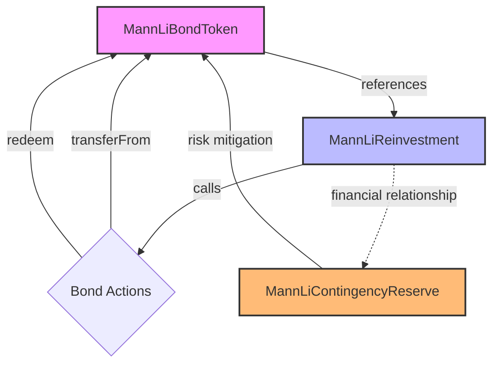

# Mann Li Method Implementation

<div align="center">
  
  
  
  
</div>

<div align="center">
  
</div>

<p align="center">
  <i>A comprehensive smart contract system for decentralized financial structuring</i>
</p>

## 📋 Overview

The Mann Li Method implements a blockchain-based financial structuring approach through a set of interconnected smart contracts. This system provides robust mechanisms for bond issuance, yield reinvestment, and risk mitigation on the Ethereum blockchain.

## 🧩 Core Components

<table>
  <tr>
    <td align="center">
      <br>
      ERC20-based bond token with step-down rate model
    </td>
    <td align="center">
      <br>
      Manages reinvestment of bond yields and buybacks
    </td>
    <td align="center">
      <br>
      Handles 20% contingency reserve for risk mitigation
    </td>
  </tr>
</table>

## 🔑 Key Features

<div align="center">
  
</div>

- **Step-down Rate Model**: 10% initial, 7.75% after 5 years
- **Automated Coupon Payments**: Regular interest distributions to bondholders
- **Reinvestment Pool**: Configurable rates (20-50%) for yield optimization
- **Emergency Contingency Reserve**: Multi-level risk mitigation system
- **Role-based Access Control**: Fine-grained permission management

## 🔄 Integration and Compatibility Analysis

The Mann Li Method creates an integrated financial ecosystem through three interdependent contracts working in concert:

### Contract Integration Flow



### 1️⃣ MannLiBondToken ↔ MannLiReinvestment

The Reinvestment contract maintains a direct reference to the Bond Token:

```solidity
MannLiBondToken public bondToken;

constructor(address _bondToken) {
    bondToken = MannLiBondToken(_bondToken);
    // ...
}
```

- Reinvestment can call `transferFrom` and `redeem` functions on the Bond Token
- Bond buybacks involve transferring tokens from holders to the Reinvestment contract, then burning them
- Event emissions in both contracts create an audit trail across the system

### 2️⃣ MannLiReinvestment ↔ MannLiContingencyReserve

While not directly linked in code, these components maintain a financial relationship:

- Both contracts maintain separate ETH reserves through their `receive()` functions
- They're designed to balance financial stability through complementary mechanisms
- Emergency functions exist in both contracts with different authorization requirements

### 3️⃣ Role-Based Access Control

<div align="center">
  
</div>

All contracts implement OpenZeppelin's AccessControl with custom roles:

- `ISSUER_ROLE` - For bond token management
- `MANAGER_ROLE` - For reinvestment operations
- `RISK_MANAGER_ROLE` - For contingency reserve handling
- `DEFAULT_ADMIN_ROLE` - Universal administrative privileges

## 🔒 System Security Features

| Feature | Description | Implementation |
|---------|-------------|----------------|
| **Pausability** | Emergency halt for critical functions | `whenNotPaused` modifier |
| **Reentrancy Protection** | Prevents reentrancy attacks | `ReentrancyGuard` inheritance |
| **Rate Limiting** | Prevents rapid state changes | Custom time-based checks |
| **Emergency Mechanisms** | Multi-level withdrawal systems | Role-based approvals |

## 📦 External Dependencies

- **OpenZeppelin Contracts v4.8.20+**
  - ERC20Pausable for token functionality
  - AccessControl for role-based permissions
  - ReentrancyGuard for security
  - Pausable for emergency halting

## 🚀 Deployment Considerations

Proper deployment order is critical for contract integration:

1. Deploy `MannLiBondToken` first
2. Deploy `MannLiReinvestment` with the bond token address
3. Deploy `MannLiContingencyReserve` with appropriate parameters
4. Configure roles across all contracts

## 🏗️ Technical Architecture

<div align="center">
  
</div>

### MannLiBondToken

A specialized ERC20 token implementing a bond instrument with:

- 10-year maturity period
- Step-down interest rate (10% → 7.75% after 5 years)
- Transfer restrictions and lockup periods
- Bond redemption and maturity claim functions

### MannLiReinvestment

Manages reinvestment strategies for bond yields:

- Configurable reinvestment rate (20-50%)
- Bond buyback mechanism with discount rates
- Cooldown periods between buybacks for each holder
- Emergency fund withdrawal capability

### MannLiContingencyReserve

Provides risk mitigation through a reserve fund:

- Emergency mode with 3 levels of severity
- Threshold-based reserve requirements
- Daily and per-transaction withdrawal limits
- Rate-limiting for administrative actions

## 💻 Development

This project uses Foundry for development and testing.

### Prerequisites

- [Foundry](https://getfoundry.sh/)
- Node.js >= 16
- npm or yarn

### Setup

```shell
# Install dependencies
forge install
npm install

# Build the project
forge build
```

### Available Commands

<details>
<summary>View Commands</summary>

```shell
# Compile contracts
forge build

# Run tests
forge test

# Run tests with gas reporting
forge test --gas-report

# Deploy contracts (local network)
forge script script/Deploy.s.sol --rpc-url localhost --broadcast

# Generate documentation
forge doc
```
</details>

## 📁 Project Structure

```
contracts/          # Smart contracts
├─ MannLiBondToken.sol
├─ MannLiReinvestment.sol
└─ MannLiContingencyReserve.sol

test/              # Test files
├─ MannLiBondToken.t.sol
├─ MannLiReinvestment.t.sol
└─ MannLiContingencyReserve.t.sol
```

## 📜 License

ISC
